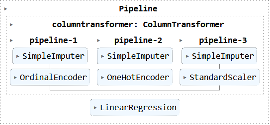

# food-sales-prediction
## Using machine learning models to analyze how well food sales can be predicted.

**Kutlukkhan Alikhanov**: 

### The prompt:

Seeing if the amount of food items sold can be predicted using various different measurements. These include: weight, fat content, visibility, type, MRP, outlet size, outlet location, and outlet type.

### Data:
[Data Source.](https://datahack.analyticsvidhya.com/contest/practice-problem-big-mart-sales-iii/)

## Methods
- Fixed inconsistencies with categorical data.
- Dropped extraneous columns.
- Performed a train test split on the data.
- Impute missing values using different techniques depending on the type of data. Mean for numerical, most frequent for ordinal, and a constant value for nominal.
- Manipulate the data using different techniques which are dependent on the type of data. StandardScaler for numerical, OneHotEncoder for nominal, OrdinalEncoder for ordinal.
- Create and perform a linear regression model.
- Create and perform a decision tree model.
- Evaluate those models using different metrics.
### Visualization of one of the final pipelines

## Results

#### Boxplot of Item Sales Compared to Outlet Types

> Here we can see a marked difference in item sales depending on the type of outlet, grocery stores generally sell a lot less than a type 3 supermarket.

#### Scatterplots of Item MRP Compared to Item Sales per Outlet Type

> This visualization shows how item MRP affects item sales with a positive correlation. In the first visual it was solidified that item sales are heavily affected by the outlet type, as such for this visualization the points are color coded depending on what outlet type they belong to. This might be hard to understand so below the first graph is a spliced version.

## Model

I decided on a decision tree model with a depth of 5. When comparing it's metrics to the linear regression model it won out.

The model's R2 Score on the testing set: ~0.5947 or ~59.47%

The model's RMSE on the testing set: ~1057

The model's MSE on the testing set: ~1118185.97

The model's MAE on the testing set: ~738

This model is not the be all end all for food item sales, but it could be helpful for business owners to be aware of what exactly affects item sales the most. Keeping in mind that RMSE weighs higher errors more heavily the RMSE is still well within 1 standard deviation of the target. While 59% R2 score is not incredibly impressive, it is far from useless. The MAE being ~738 means that on average the predictions are off by 738 items sold (either in the positive or negative). 

## Recommendations:

I would recommend implementing the decision tree model. There are a couple of reasons I recommend implementing the decision tree model rather than the linear regression model but the most important is that the R2 score is higher. The decision tree model is able to account for more variance than the linear regression model. Another reason to use the decision tree is that in general decision trees are interpretable and easy to understand. You also are given the choice of scaling or not scaling your data, in this case I did so but if for whatever reason you do not want to you can always forgo that step/ undo it.
