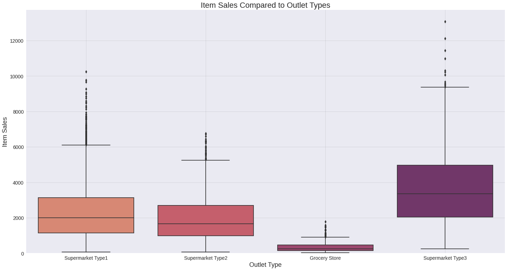
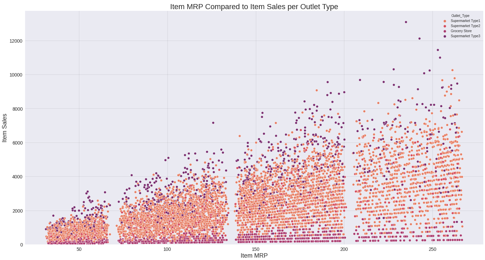
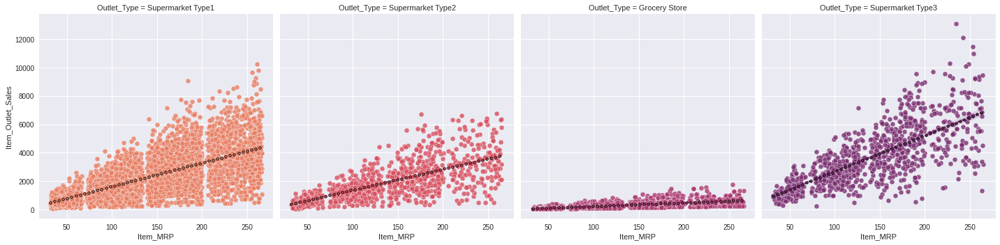

# food-sales-prediction
## Using machine learning models to analyze how well food sales can be predicted.

**Kutlukkhan Alikhanov**: 

### The prompt:

Seeing if the amount of food items sold can be predicted using various different measurements. These include: weight, fat content, visibility, type, MRP, outlet size, outlet location, and outlet type.

### Data:
[Data Source.](https://datahack.analyticsvidhya.com/contest/practice-problem-big-mart-sales-iii/)

## Methods
- Fixed inconsistencies with categorical data.
- Dropped extraneous columns.
- Performed a train test split on the data.
- Impute missing values using different techniques depending on the type of data. Mean for numerical, most frequent for ordinal, and a constant value for nominal.
- Manipulate the data using different techniques which are dependent on the type of data. StandardScaler for numerical, OneHotEncoder for nominal, OrdinalEncoder for ordinal.
- Create and perform a linear regression model.
- Create and perform a decision tree model.
### Example Visualization of the final pipeline

## Results

#### Visual 1 Title

> Sentence about visualization.

#### Visual 2 Title

> Sentence about visualization.

## Model

Describe your final model

Report the most important metrics

Refer to the metrics to describe how well the model would solve the business problem

## Recommendations:

More of your own text here

## Limitations & Next Steps

More of your own text here
